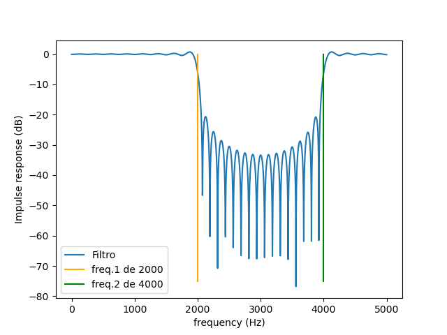

# Filtros Digitais - Método da Janela

Esta pasta reúne anotações, implementações computacionais e exemplos relacionados ao **projeto de filtros FIR utilizando o método da janela**, conteúdo estudado na disciplina **Processamento de Sinais I**.

O objetivo deste material é consolidar os conceitos teóricos envolvidos no projeto de filtros digitais, mostrando como uma resposta em frequência ideal pode ser aproximada por um filtro FIR de ordem finita através da aplicação de diferentes funções janela.

---

# Objetivos

Ao estudar este material, espera-se compreender:

* O conceito de filtros digitais FIR;
* A relação entre a resposta em frequência e a resposta ao impulso;
* O processo de obtenção da resposta ao impulso ideal;
* O efeito do truncamento da resposta ao impulso;
* O funcionamento do método da janela;
* As características das principais funções janela utilizadas no projeto de filtros FIR;
* A influência da escolha da janela na resposta em frequência do filtro.

---

# Conteúdo abordado

## Filtros FIR

Os filtros **Finite Impulse Response (FIR)** possuem resposta ao impulso de duração finita e são amplamente utilizados devido à sua estabilidade e à possibilidade de apresentar fase linear.

Sua saída é obtida através da convolução entre o sinal de entrada e a resposta ao impulso do filtro.

### Exemplo

```text
y[n] = x[n] * h[n]
```

onde:

* `x[n]` é o sinal de entrada;
* `h[n]` é a resposta ao impulso;
* `y[n]` é o sinal filtrado.

---

## Resposta ao Impulso Ideal

O projeto de um filtro FIR inicia-se a partir da especificação da resposta em frequência desejada.

Aplicando a Transformada Inversa de Fourier, obtém-se uma resposta ao impulso ideal, normalmente de comprimento infinito e, portanto, impossível de ser implementada diretamente.

Por esse motivo, torna-se necessário aproximar essa resposta utilizando técnicas de truncamento.

---

## Método da Janela

O método da janela consiste em multiplicar a resposta ao impulso ideal por uma função janela de comprimento finito.

Essa operação reduz o comprimento do filtro, tornando sua implementação possível.

De forma geral:

```text
h[n] = h_d[n] · w[n]
```

onde:

* `h_d[n]` é a resposta ao impulso ideal;
* `w[n]` é a função janela;
* `h[n]` é a resposta ao impulso do filtro projetado.

---

## Fenômeno de Gibbs

Ao truncar uma resposta ao impulso infinita, surgem oscilações na resposta em frequência do filtro, conhecidas como **Fenômeno de Gibbs**.

A utilização de funções janela reduz essas oscilações, proporcionando melhor comportamento na banda de passagem e na banda de rejeição.

---

## Funções Janela

Cada função janela apresenta um compromisso entre:

* largura da banda de transição;
* atenuação dos lóbulos laterais;
* custo computacional.

As janelas mais utilizadas são:

* Janela Retangular;
  
* Janela Bartlett;
* Janela Hann;
* Janela Hamming;
* Janela Blackman;
* Janela Kaiser.

Cada uma delas produz respostas em frequência com características distintas.

---

## Influência da Ordem do Filtro

A ordem do filtro está diretamente relacionada com sua capacidade de aproximação da resposta ideal.

Em geral:

* ordens maiores produzem bandas de transição menores;
* aumentam a quantidade de coeficientes do filtro;
* elevam o custo computacional da implementação.

O projeto do filtro consiste em encontrar um equilíbrio entre desempenho e complexidade.

---

## Implementações Computacionais

Além das anotações teóricas, esta pasta contém programas utilizados para:

* calcular respostas ao impulso;
* gerar funções janela;
* projetar filtros FIR;
* visualizar respostas em frequência;
* analisar o efeito da variação da ordem e da janela utilizada.

Essas implementações permitem comparar diferentes projetos de filtros de maneira prática.

---

# Estrutura da pasta

```text
Filtros-Janela/
│
├── ...
│
└── README.md
```

---

# Competências desenvolvidas

Durante o desenvolvimento deste material foram praticados conceitos relacionados a:

* filtros digitais FIR;
* resposta ao impulso;
* Transformada de Fourier;
* método da janela;
* funções janela;
* fenômeno de Gibbs;
* resposta em frequência;
* projeto de filtros digitais;
* implementação computacional em Python.

---

# Tecnologias utilizadas

Os programas presentes nesta pasta utilizam principalmente:

* Python 3
* NumPy
* Matplotlib
* SciPy

---

# Referências

Os materiais e implementações presentes nesta pasta foram desenvolvidos com base no conteúdo apresentado na disciplina **Processamento de Sinais I**, complementado por bibliografias clássicas de Processamento Digital de Sinais, como:

* Alan V. Oppenheim e Ronald W. Schafer — *Discrete-Time Signal Processing*;
* John G. Proakis e Dimitris G. Manolakis — *Digital Signal Processing: Principles, Algorithms and Applications*.

---

## Autor

**Ricardo Alexandre Vieira**

Graduando em Engenharia de Telecomunicações — CEFET/RJ

GitHub: [https://github.com/RicardoV1e1r4](https://github.com/RicardoV1e1r4)

